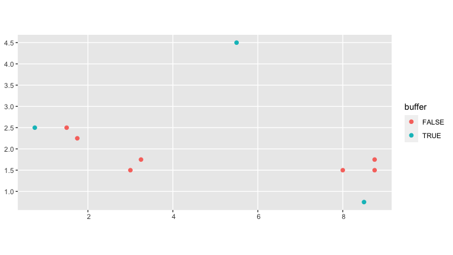
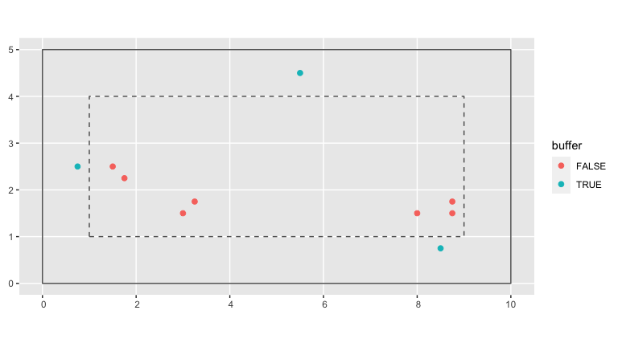
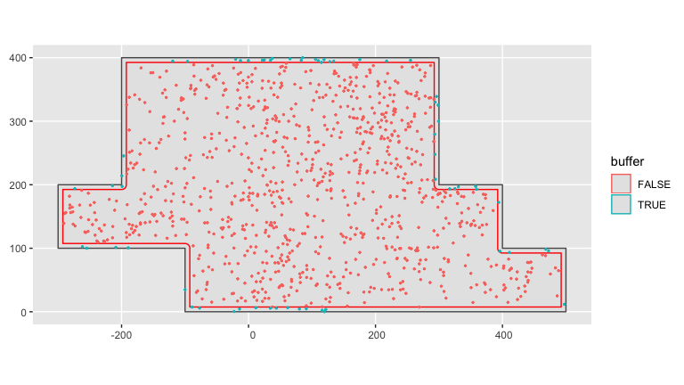
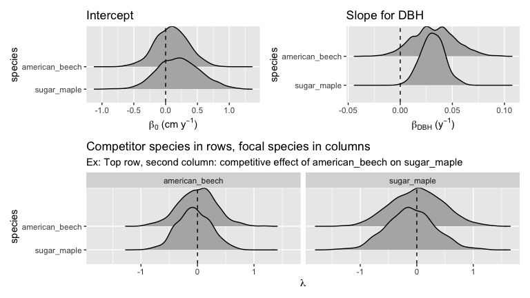

<!-- README.md is generated from README.Rmd. Please edit that file -->

# forestecology

[](https://github.com/rudeboybert/forestecology/actions)
[](https://www.tidyverse.org/lifecycle/#experimental)
[](https://cran.r-project.org/package=forestecology)

## Installation

You can install the released version of forestecology from
[CRAN](https://CRAN.R-project.org) with:

``` r
install.packages("forestecology")
```

And the development version from [GitHub](https://github.com/) with:

``` r
# install.packages("remotes")
remotes::install_github("rudeboybert/forestecology")
```

This package is designed to work for spatially mapped, repeat censused
forests plots. The package has commands to fit models of tree growth
based on neighborhood competition which can be used to estimate
species-specific competition coefficients. The model fits can then be
evaluated using a spatial cross-validation scheme to detect possible
overfitting. Additionally, these models can test whether the species
identity of competitors matters using a permutation test-style shuffling
of competitor identity (under the null hypothesis) and subsequently
evaluating if model performance changes. See Allen and Kim (2020) [A
permutation test and spatial cross-validation approach to assess models
of interspecific competition between
trees](https://doi.org/10.1371/journal.pone.0229930) for a full
description.

## Example analysis

We present an example analysis using toy data pre-loaded into the
package.

``` r
library(tidyverse)
library(forestecology)
library(sf)
library(sfheaders)
library(blockCV)
library(yardstick)
library(snakecase)
library(patchwork)
library(tidyr)
```

### Compute growth of trees based on census data

The starting point of our analysis are data from two repeat censuses
`census_1_ex` and `census_2_ex`. For example, consider the forest census
data in `census_1_ex`.

``` r
census_1_ex
#> # A tibble: 10 x 7
#>       ID sp                gx    gy date       codes   dbh
#>    <int> <chr>          <dbl> <dbl> <date>     <chr> <dbl>
#>  1     1 sugar maple     0.75  2.5  2015-06-01 M         5
#>  2     2 American beech  1.5   2.5  2015-06-01 M        20
#>  3     3 sugar maple     1.75  2.25 2015-06-01 M        15
#>  4     4 American beech  3     1.5  2015-06-01 M        12
#>  5     5 sugar maple     3.25  1.75 2015-06-01 M        35
#>  6     6 American beech  5.5   4.5  2015-06-01 M         6
#>  7     7 sugar maple     8     1.5  2015-06-01 M        22
#>  8     8 American beech  8.5   0.75 2015-06-01 M        14
#>  9     9 sugar maple     8.75  1.5  2015-06-01 M        42
#> 10    10 American beech  8.75  1.75 2015-06-01 M         4
```

We convert the `census_1_ex` data frame to an object of type `sf` and
then plot using `geom_sf()`.

``` r
ggplot() +
  geom_sf(
    data = census_1_ex %>% sf::st_as_sf(coords = c("gx", "gy")),
    aes(col = sp, size = dbh)
  )
```



We first combine data from two repeat censuses into a single `growth`
data frame that has the average annual growth of all trees alive at both
censuses that aren’t resprouts at the second census per Allen and Kim
(2020).

``` r
growth_ex <-
  compute_growth(
    census_1 = census_1_ex,
    census_2 = census_2_ex %>% filter(!str_detect(codes, "R")),
    id = "ID"
    ) %>%
  mutate(sp = snakecase::to_any_case(sp) %>% factor())
```

### Add spatial information

Our growth model assumes that two individual trees compete if they are
less than a pre-specified distance `comp_dist` apart. Furthermore, we
define a buffer region of size `comp_dist` from the boundary of the
study region.

``` r
# Set competitor distance
comp_dist <- 1

# Add buffer variable to growth data frame
growth_ex <- growth_ex %>%
  add_buffer_variable(direction = "in", size = comp_dist, region = study_region_ex)

# Optional: Create sf representation of buffer region
buffer_region <- study_region_ex %>% 
  compute_buffer_region(direction = "in", size = comp_dist)
```

In the visualization below, the solid line represents the boundary of
the study region while the dashed line delimits the buffer region
within. All trees outside this buffer region (in red) will be our
“focal” trees of interest in our model since we have complete
competitor information on all of them. All trees inside this buffer
region (in blue) will only be considered as “competitor” trees to
“focal” trees.

``` r
base_plot <- ggplot() +
  geom_sf(data = study_region_ex, fill = "transparent") +
  geom_sf(data = buffer_region, fill = "transparent", linetype = "dashed")

base_plot + 
  geom_sf(data = growth_ex, aes(col = buffer), size = 2)
```



Next we add information pertaining to our spatial cross-validation
scheme. We first manually define the spatial blocks that will act as our
cross-validation folds and convert them to an `sf` object.

``` r
fold1 <- rbind(c(0, 0), c(5, 0), c(5, 5), c(0, 5), c(0, 0))
fold2 <- rbind(c(5, 0), c(10, 0), c(10, 5), c(5, 5), c(5, 0))

blocks_ex <- bind_rows(
  sfheaders::sf_polygon(fold1),
  sfheaders::sf_polygon(fold2)
) %>%
  mutate(folds = c(1, 2) %>% factor())
```

Next we assign each tree to the correct folds using the `foldID`
variable of the output returned by the `spatialBlock()` function from
the [`blockCV`](https://github.com/rvalavi/blockCV) package.

``` r
SpatialBlock_ex <- blockCV::spatialBlock(
  speciesData = growth_ex, k = 2, selection = "systematic", blocks = blocks_ex,
  showBlocks = FALSE, verbose = FALSE
)

growth_ex <- growth_ex %>%
  mutate(foldID = SpatialBlock_ex$foldID %>% factor())
```

In the visualization below, the spatial blocks that act as our
cross-validation folds are delineated in orange. The shape of each point
indicates which fold each tree has been assigned to.

``` r
base_plot + 
  geom_sf(data = growth_ex, aes(col = buffer, shape = foldID), size = 2) +
  geom_sf(data = blocks_ex, fill = "transparent", col = "orange")
```



### Compute focal versus competitor tree information

Based on our `growth` data frame, we now explicitly define all “focal”
trees and their respective “competitor” trees in a `focal_vs_comp` data
frame. This data frame has rows corresponding to each focal tree, and
all information about its competitors are saved in the list-column
variable `comp`. We implemented this nested format using `nest()` in
order to minimize redundancy, given that the same tree can act as a
competitor multiple times.

``` r
focal_vs_comp_ex <- growth_ex %>%
  create_focal_vs_comp(comp_dist, cv_grid_sf = blocks_ex, id = "ID")
focal_vs_comp_ex
#> # A tibble: 6 x 7
#>   focal_ID focal_sp         dbh foldID    geometry growth comp            
#>      <dbl> <fct>          <dbl> <fct>      <POINT>  <dbl> <list>          
#> 1        2 american_beech    20 1        (1.5 2.5)  0.800 <tibble [2 × 4]>
#> 2        3 sugar_maple       15 1      (1.75 2.25)  1.00  <tibble [1 × 4]>
#> 3        4 american_beech    12 1          (3 1.5)  0.400 <tibble [1 × 4]>
#> 4        5 sugar_maple       35 1      (3.25 1.75)  1.40  <tibble [1 × 4]>
#> 5        7 sugar_maple       22 2          (8 1.5)  0.600 <tibble [3 × 4]>
#> 6        9 sugar_maple       42 2       (8.75 1.5)  1.40  <tibble [3 × 4]>
```

Using `unnest()` we can fully expand the competitor information saved in
the `focal_vs_comp` data frame. For example, the tree with `focal_ID`
equal to 2 located at (1.5, 2.5) has two competitors within `comp_dist`
distance from it.

``` r
focal_vs_comp_ex %>% 
  unnest(cols = "comp")
#> # A tibble: 11 x 10
#>    focal_ID focal_sp   dbh foldID                  geometry growth comp_ID  dist
#>       <dbl> <fct>    <dbl> <fct>                    <POINT>  <dbl>   <dbl> <dbl>
#>  1        2 america…    20 1                      (1.5 2.5)  0.800       1 0.75 
#>  2        2 america…    20 1                      (1.5 2.5)  0.800       3 0.354
#>  3        3 sugar_m…    15 1                    (1.75 2.25)  1.00        2 0.354
#>  4        4 america…    12 1                        (3 1.5)  0.400       5 0.354
#>  5        5 sugar_m…    35 1                    (3.25 1.75)  1.40        4 0.354
#>  6        7 sugar_m…    22 2                        (8 1.5)  0.600       8 0.901
#>  7        7 sugar_m…    22 2                        (8 1.5)  0.600       9 0.75 
#>  8        7 sugar_m…    22 2                        (8 1.5)  0.600      10 0.791
#>  9        9 sugar_m…    42 2                     (8.75 1.5)  1.40        7 0.75 
#> 10        9 sugar_m…    42 2                     (8.75 1.5)  1.40        8 0.791
#> 11        9 sugar_m…    42 2                     (8.75 1.5)  1.40       10 0.25 
#> # … with 2 more variables: comp_sp <fct>, comp_basal_area <dbl>
```

### Fit model and make predictions

We then fit our competitor growth model as specified in Allen and Kim
(2020).

``` r
comp_bayes_lm_ex <- focal_vs_comp_ex %>%
  comp_bayes_lm(prior_param = NULL)
```

The resulting output is an `comp_bayes_lm` object containing the
posterior distribution of all linear regression parameters, the
intercept, the slope for dbh for each species, and a matrix of all
species pairs competitive effects on growth. The S3 object class is
associated with several methods.

``` r
# Print
comp_bayes_lm_ex
#> Parameters of a Bayesian linear regression model with a multivariate Normal likelihood
#> (for details see https://doi.org/10.1371/journal.pone.0229930.s004):
#> 
#>   parameter_type           prior posterior
#> 1 Inverse-Gamma on sigma^2 a_0   a_star   
#> 2 Inverse-Gamma on sigma^2 b_0   b_star   
#> 3 Multivariate t on beta   mu_0  mu_star  
#> 4 Multivariate t on beta   V_0   V_star   
#> 
#> Model formula:
#> growth ~ sp + dbh + dbh * sp + american_beech * sp + sugar_maple * sp

# Posterior distributions (plots combined with patchwork pkg)
p1 <- autoplot(comp_bayes_lm_ex, type = "intercepts")
p2 <- autoplot(comp_bayes_lm_ex, type = "dbh_slopes")
p3 <- autoplot(comp_bayes_lm_ex, type = "competition")
(p1 | p2) / p3
```



Furthermore, we can apply a `predict()` method to the resulting
`comp_bayes_lm` object to obtain fitted/predicted values of this model.
We append these `growth_hat` values to our `focal_vs_comp` data frame.

``` r
focal_vs_comp_ex <- focal_vs_comp_ex %>%
  mutate(growth_hat = predict(comp_bayes_lm_ex, focal_vs_comp_ex))
focal_vs_comp_ex
#> # A tibble: 6 x 8
#>   focal_ID focal_sp   dbh foldID                  geometry growth comp 
#>      <dbl> <fct>    <dbl> <fct>                    <POINT>  <dbl> <lis>
#> 1        2 america…    20 1                      (1.5 2.5)  0.800 <tib…
#> 2        3 sugar_m…    15 1                    (1.75 2.25)  1.00  <tib…
#> 3        4 america…    12 1                        (3 1.5)  0.400 <tib…
#> 4        5 sugar_m…    35 1                    (3.25 1.75)  1.40  <tib…
#> 5        7 sugar_m…    22 2                        (8 1.5)  0.600 <tib…
#> 6        9 sugar_m…    42 2                     (8.75 1.5)  1.40  <tib…
#> # … with 1 more variable: growth_hat <dbl>
```

We then compute the root mean squared error (RMSE) of the observed
versus fitted growths as a measure of our model’s fit.

``` r
focal_vs_comp_ex %>%
  yardstick::rmse(truth = growth, estimate = growth_hat) %>%
  pull(.estimate)
#> [1] 0.1900981
```

### Run spatial cross-validation

Whereas in our example above we fit our model to the entirety of the
data and then generate fitted/predicted growths on this same data, we
now apply the same model with spatial cross-validation. All the trees in
a given fold will be given a turn as the “test” data while the trees in
all remaining folds will be the “training” data. We then fit the model
to the training data, but compute fitted/predicted growths for the
separate and independent data.

``` r
focal_vs_comp_ex <- focal_vs_comp_ex %>%
  run_cv(comp_dist = comp_dist, cv_grid = cv_grid_sf_ex)
```

Note the increase in RMSE, reflecting the fact that our original
estimate of model error was overly optimistic as it did not account for
spatial autocorrelation.

``` r
focal_vs_comp_ex %>%
  yardstick::rmse(truth = growth, estimate = growth_hat) %>%
  pull(.estimate)
#> [1] 0.4068709
```

<!--For fuller examples on actual datasets see ___.-->
