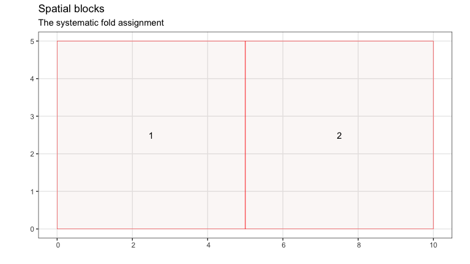
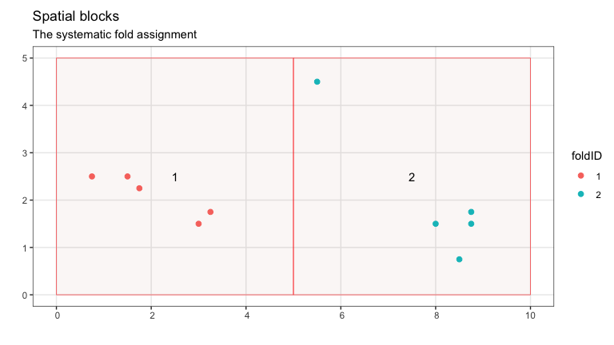
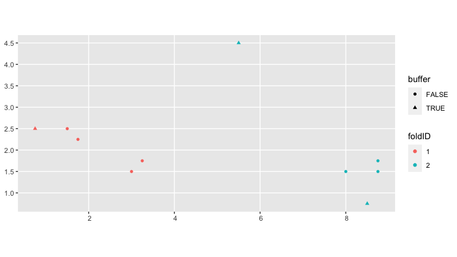

<!-- README.md is generated from README.Rmd. Please edit that file -->

# forestecology

[](https://travis-ci.org/rudeboybert/forestecology)
[](https://www.tidyverse.org/lifecycle/#experimental)
[](https://cran.r-project.org/package=forestecology)

## Installation

You can install the released version of forestecology from
[CRAN](https://CRAN.R-project.org) with:

``` r
install.packages("forestecology")
```

And the development version from [GitHub](https://github.com/) with:

``` r
# install.packages("remotes")
# remotes::install_github("rudeboybert/forestecology")
```

This package is designed to work for spaitally mapped, repeat censused
forests plots. The package has commands to fit models of tree growth
based on neighborhood competition. This can be used to estimate
species-specific competition coefficients. The models can be fit with a
spatial cross validation scheme to avoid overfitting. Additionally these
models can test whether the idenity of competitors matters, by shuffling
competitor identity and testing whether model preformance changes. See
Allen and Kim (2020) for a full descripition.

## Example analysis

``` r
library(tidyverse)
library(forestecology)
library(sf)
library(sfheaders)
library(blockCV)
library(yardstick)
```

Here we provide an example with a small dateset. First we combine the
two census data files into a single `tibble` with the growth of each
surviving individual.

``` r
# Read in census files
data(census_df1_ex, census_df2_ex)

# Filter out resprouts
census_df2_ex_no_r <- census_df2_ex %>%
  filter(!str_detect(codes, 'R'))

id <- 'ID'

ex_growth_df <-
  # Merge both censuses and compute growth:
  compute_growth(census_df1_ex, census_df2_ex_no_r, id) %>%
  mutate(
    sp = to_any_case(sp),
    sp = as.factor(sp)) 
```

All growth models in the package assume that two individuals compete if
they are less than a specified distance away. Here we set this distance
and put all individuals within this distance of a plot boundray in a
buffer (since we do not have full information about their competitors).

``` r
data("ex_study_region")

# set max dist
max_dist <- 1

# add buffer
ex_growth_df <- ex_growth_df %>%
  add_buffer_variable(direction = "in", size = max_dist, region = ex_study_region)

ggplot() +
  geom_sf(data = ex_growth_df, aes(col = buffer), size = 2)
```


We then set blocks for the cross validation scheme.

``` r
# Bert's solution: Manually create a blocks sf object
fold1 <- rbind(c(0, 0), c(5, 0), c(5, 5), c(0, 5), c(0, 0))
fold2 <- rbind(c(5, 0), c(10, 0), c(10, 5), c(5, 5), c(5, 0))
blocks <- bind_rows(
  sf_polygon(fold1),
  sf_polygon(fold2) ) %>%
  mutate(foldID = c(1, 2))

# Plot
ggplot() +
  geom_sf(data = ex_growth_df, aes(col = buffer), size = 2) +
  geom_sf(data = blocks, fill = "transparent")
```


``` r

# fit spatialBlock()
ex_cv_grid <- spatialBlock(
  speciesData = ex_growth_df,
  verbose = FALSE,
  k = 2,
  # Note new arguments
  selection = "systematic",
  blocks = blocks#,
 # foldsCol = "foldID"
)
```



``` r

# Add foldID to data
ex_growth_df <- ex_growth_df %>%
  mutate(foldID = ex_cv_grid$foldID %>% as.factor())

# Visualize grid
ex_cv_grid$plots +
  geom_sf(data = ex_growth_df, aes(col = foldID), size = 2)
```



``` r

# Deliverable
ggplot() +
  geom_sf(data = ex_growth_df, aes(col = foldID, shape = buffer))
```



``` r


ex_cv_grid_sf <- ex_cv_grid$blocks %>%
  st_as_sf()
```

We then create a `focal_v_comp` tibble which has a row for each
competing pair of individuals (each pair of individuals within
`max_dist` of one another).

``` r

# focal v comp
focal_vs_comp_ex <- ex_growth_df %>% 
  create_focal_vs_comp(max_dist, cv_grid_sf = ex_cv_grid_sf, id = "ID")
```

With `focal_v_comp` we can then run the growth model and get predictions
from it. Here we run the model without cross validation. Posterior
estimates can be plotted to give, for example, the lambda matrix of
competition coefficents.

``` r
# fit the model
posterior_param_ex <- focal_vs_comp_ex %>% 
  fit_bayesian_model(prior_param = NULL, run_shuffle = FALSE)

# get predictions
predictions <- focal_vs_comp_ex %>%
  predict_bayesian_model(posterior_param = posterior_param_ex) %>%
  right_join(ex_growth_df, by = c("focal_ID" = "ID"))
predictions %>%
  rmse(truth = growth, estimate = growth_hat) %>%
  pull(.estimate)
#> [1] 0.1900981

# plot posteriors
plot_ex <- posterior_param_ex %>%
  plot_posterior_parameters()

plot_ex[["lambda"]]
```


Here we repeat the model fitting but with cross-validation. Note the
increase in RMSE.

``` r
# run model with CV
ex_bw <- focal_vs_comp_ex %>% 
  run_cv(max_dist = max_dist, cv_grid = ex_cv_grid) %>%
  right_join(ex_growth_df, by = c("focal_ID" = "ID"))

ex_bw %>%
  rmse(truth = growth, estimate = growth_hat) %>%
  pull(.estimate)
#> [1] 0.4068709
```

For fuller examples on actual datasets see \_\_\_.
