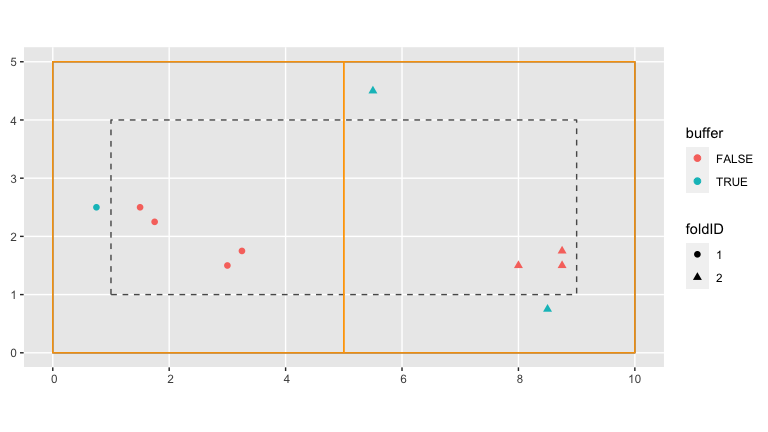
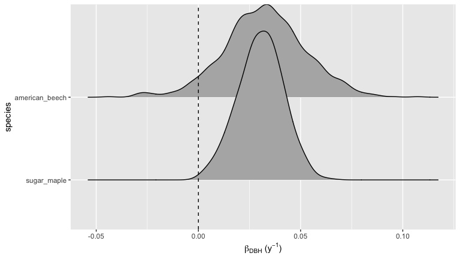
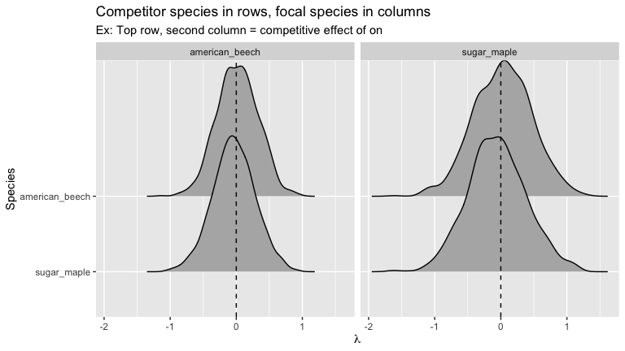

<!-- README.md is generated from README.Rmd. Please edit that file -->

# forestecology

[](https://github.com/rudeboybert/forestecology/actions)
[](https://www.tidyverse.org/lifecycle/#experimental)
[](https://cran.r-project.org/package=forestecology)

## Installation

You can install the released version of forestecology from
[CRAN](https://CRAN.R-project.org) with:

``` r
install.packages("forestecology")
```

And the development version from [GitHub](https://github.com/) with:

``` r
# install.packages("remotes")
remotes::install_github("rudeboybert/forestecology")
```

This package is designed to work for spatially mapped, repeat censused
forests plots. The package has commands to fit models of tree growth
based on neighborhood competition which can be used to estimate
species-specific competition coefficients. The models fits can then be
evaluated using a spatial cross-validation scheme to detect possible
overfitting. Additionally these models can test whether the species
identity of competitors matters using a permutation test-style shuffling
of competitor identity (under the null hypothesis) and subsequently
evaluating if model performance changes. See Allen and Kim (2020) [A
permutation test and spatial cross-validation approach to assess models
of interspecific competition between
trees](https://doi.org/10.1371/journal.pone.0229930) for a full
description.

## Example analysis

We present an example analysis using toy data pre-loaded into the
package.

``` r
library(tidyverse)
library(forestecology)
library(sf)
library(sfheaders)
library(blockCV)
library(yardstick)
library(snakecase)
```

### Preprocess census data

We first combine data from two repeat censuses into a single `tibble`
and compute the growth of all surviving individuals. Note that per Allen
and Kim (2020) we first remove resprouts from the second census.

``` r
data(census_df1_ex, census_df2_ex)

# Filter out resprouts
census_df2_ex_no_r <- census_df2_ex %>%
  filter(!str_detect(codes, "R"))

# Merge both censuses and compute growth. Note we require any species variable
# to be coded as a factor
census_combined_ex <-
  compute_growth(census_df1_ex, census_df2_ex_no_r, id = "ID") %>%
  mutate(sp = to_any_case(sp) %>% as.factor())
```

### Add spatial information

Our growth model assumes that two individual trees compete if they are
less than a pre-specified distance `max_dist` apart. Furthermore, we
define a buffer region of size `max_dist` from the boundary of the study
region. All trees outside this buffer region will be our “focal” trees
of interest since we have complete competitor information on them. All
trees inside this buffer region will only be considered as “competitor”
trees to “focal” trees.

``` r
data("ex_study_region")

# Set competitor distance
max_dist <- 1

# Create sf representation of buffer region
buffer_region <- ex_study_region %>% 
  compute_buffer_region(direction = "in", size = max_dist)

# Add buffer variable
census_combined_ex <- census_combined_ex %>%
  add_buffer_variable(direction = "in", size = max_dist, region = ex_study_region)

base_plot <- ggplot() +
  geom_sf(data = ex_study_region, fill = "transparent") +
  geom_sf(data = buffer_region, fill = "transparent", linetype = "dashed")

base_plot + 
  geom_sf(data = census_combined_ex, aes(col = buffer), size = 2)
```


We then manually define the blocks/folds for our spatial
cross-validation scheme and convert them to an `sf` object using
`sfheaders::sf_polygon()`:

``` r
fold1 <- rbind(c(0, 0), c(5, 0), c(5, 5), c(0, 5), c(0, 0))
fold2 <- rbind(c(5, 0), c(10, 0), c(10, 5), c(5, 5), c(5, 0))

blocks <- bind_rows(
  sf_polygon(fold1),
  sf_polygon(fold2)
) %>%
  mutate(foldID = c(1, 2))
```

Next we assign each tree to blocks/folds using the `spatialBlock()`
function from the [`blockCV`](https://github.com/rvalavi/blockCV)
package.

``` r
ex_cv_grid <- spatialBlock(
  speciesData = census_combined_ex, k = 2, selection = "systematic", blocks = blocks,
  showBlocks = FALSE, verbose = FALSE
)

# Add fold information to data
census_combined_ex <- census_combined_ex %>%
  mutate(foldID = ex_cv_grid$foldID %>% factor())

base_plot + 
  geom_sf(data = census_combined_ex, aes(col = buffer, shape = foldID), size = 2) +
  geom_sf(data = blocks, fill = "transparent", col = "orange")
```


We also extract the spatial cross-validation grid itself as an `sf`
object for later use.

``` r
ex_cv_grid_sf <- ex_cv_grid$blocks %>%
  st_as_sf()

ggplot() +
  geom_sf(data = ex_cv_grid_sf)
```


### Define focal versus competitor trees

We then create a list-column data frame (via `tidyr::nest()`) where each
row represents a focal tree of interest and the `comp` variable contains
nested information on each of it’s competitors

which has a row for each competing pair of individuals (each pair of
individuals within `max_dist` of one another):

``` r
focal_vs_comp_ex <- census_combined_ex %>%
  create_focal_vs_comp(max_dist, cv_grid_sf = ex_cv_grid_sf, id = "ID")

# Nested view
focal_vs_comp_ex
#> # A tibble: 6 x 7
#>   focal_ID focal_sp         dbh foldID    geometry growth comp            
#>      <dbl> <fct>          <dbl> <fct>      <POINT>  <dbl> <list>          
#> 1        2 american_beech    20 1        (1.5 2.5)  0.800 <tibble [2 × 4]>
#> 2        3 sugar_maple       15 1      (1.75 2.25)  1.00  <tibble [1 × 4]>
#> 3        4 american_beech    12 1          (3 1.5)  0.400 <tibble [1 × 4]>
#> 4        5 sugar_maple       35 1      (3.25 1.75)  1.40  <tibble [1 × 4]>
#> 5        7 sugar_maple       22 2          (8 1.5)  0.600 <tibble [3 × 4]>
#> 6        9 sugar_maple       42 2       (8.75 1.5)  1.40  <tibble [3 × 4]>

# Unnested view:
focal_vs_comp_ex %>% 
  unnest(cols = "comp")
#> # A tibble: 11 x 10
#>    focal_ID focal_sp   dbh foldID                  geometry growth comp_ID  dist
#>       <dbl> <fct>    <dbl> <fct>                    <POINT>  <dbl>   <dbl> <dbl>
#>  1        2 america…    20 1                      (1.5 2.5)  0.800       1 0.75 
#>  2        2 america…    20 1                      (1.5 2.5)  0.800       3 0.354
#>  3        3 sugar_m…    15 1                    (1.75 2.25)  1.00        2 0.354
#>  4        4 america…    12 1                        (3 1.5)  0.400       5 0.354
#>  5        5 sugar_m…    35 1                    (3.25 1.75)  1.40        4 0.354
#>  6        7 sugar_m…    22 2                        (8 1.5)  0.600       8 0.901
#>  7        7 sugar_m…    22 2                        (8 1.5)  0.600       9 0.75 
#>  8        7 sugar_m…    22 2                        (8 1.5)  0.600      10 0.791
#>  9        9 sugar_m…    42 2                     (8.75 1.5)  1.40        7 0.75 
#> 10        9 sugar_m…    42 2                     (8.75 1.5)  1.40        8 0.791
#> 11        9 sugar_m…    42 2                     (8.75 1.5)  1.40       10 0.25 
#> # … with 2 more variables: comp_sp <fct>, comp_basal_area <dbl>
```

### Fit model and make predictions

We then fit our competitor growth model as specified in Allen and Kim
(2020)

``` r
comp_bayes_lm_ex <- focal_vs_comp_ex %>%
  comp_bayes_lm(prior_param = NULL, run_shuffle = FALSE)
```

Since the resulting output is an S3 object of class `comp_bayes_lm`, we
can both print and visualize its output: the posterior distribution of
all the linear regression parameters.

``` r
# Object summary
comp_bayes_lm_ex
#> $prior_params
#> $prior_params$a_0
#> [1] 250
#> 
#> $prior_params$b_0
#> [1] 25
#> 
#> $prior_params$mu_0
#>      [,1]
#> [1,]    0
#> [2,]    0
#> [3,]    0
#> [4,]    0
#> [5,]    0
#> [6,]    0
#> [7,]    0
#> [8,]    0
#> 
#> $prior_params$V_0
#>      [,1] [,2] [,3] [,4] [,5] [,6] [,7] [,8]
#> [1,]    1    0    0    0    0    0    0    0
#> [2,]    0    1    0    0    0    0    0    0
#> [3,]    0    0    1    0    0    0    0    0
#> [4,]    0    0    0    1    0    0    0    0
#> [5,]    0    0    0    0    1    0    0    0
#> [6,]    0    0    0    0    0    1    0    0
#> [7,]    0    0    0    0    0    0    1    0
#> [8,]    0    0    0    0    0    0    0    1
#> 
#> 
#> $post_params
#> $post_params$a_star
#> [1] 253
#> 
#> $post_params$b_star
#> [1] 25.12089
#> 
#> $post_params$mu_star
#>                                      [,1]
#> (Intercept)                   0.083819125
#> spsugar_maple                 0.113931378
#> dbh                           0.033355199
#> american_beech                0.006250450
#> sugar_maple                  -0.046483896
#> spsugar_maple:dbh            -0.002587294
#> spsugar_maple:american_beech  0.006250450
#> spsugar_maple:sugar_maple    -0.039783887
#> 
#> $post_params$V_star
#>                               (Intercept) spsugar_maple           dbh
#> (Intercept)                   0.691319289  -0.224229160 -0.0404523384
#> spsugar_maple                -0.224229160   0.746619818  0.0131442503
#> dbh                          -0.040452338   0.013144250  0.0042064465
#> american_beech               -0.007634041  -0.008580683  0.0004467626
#> sugar_maple                  -0.032044185  -0.011296992 -0.0009065543
#> spsugar_maple:dbh             0.026112952  -0.029195775 -0.0033641647
#> spsugar_maple:american_beech -0.007634041  -0.008580683  0.0004467626
#> spsugar_maple:sugar_maple    -0.014855675  -0.017044786  0.0009068123
#>                              american_beech   sugar_maple spsugar_maple:dbh
#> (Intercept)                   -7.634041e-03 -0.0320441845      0.0261129520
#> spsugar_maple                 -8.580683e-03 -0.0112969920     -0.0291957747
#> dbh                            4.467626e-04 -0.0009065543     -0.0033641647
#> american_beech                 9.996076e-01  0.0002161445     -0.0004693054
#> sugar_maple                    2.161445e-04  0.9827276993      0.0010241026
#> spsugar_maple:dbh             -4.693054e-04  0.0010241026      0.0037292520
#> spsugar_maple:american_beech  -3.924257e-04  0.0002161445     -0.0004693054
#> spsugar_maple:sugar_maple      2.510005e-05 -0.0129115517     -0.0011460871
#>                              spsugar_maple:american_beech
#> (Intercept)                                 -7.634041e-03
#> spsugar_maple                               -8.580683e-03
#> dbh                                          4.467626e-04
#> american_beech                              -3.924257e-04
#> sugar_maple                                  2.161445e-04
#> spsugar_maple:dbh                           -4.693054e-04
#> spsugar_maple:american_beech                 9.996076e-01
#> spsugar_maple:sugar_maple                    2.510005e-05
#>                              spsugar_maple:sugar_maple
#> (Intercept)                              -1.485568e-02
#> spsugar_maple                            -1.704479e-02
#> dbh                                       9.068123e-04
#> american_beech                            2.510005e-05
#> sugar_maple                              -1.291155e-02
#> spsugar_maple:dbh                        -1.146087e-03
#> spsugar_maple:american_beech              2.510005e-05
#> spsugar_maple:sugar_maple                 9.866460e-01
#> 
#> $post_params$sp_list
#> [1] "american_beech" "sugar_maple"   
#> 
#> 
#> $terms
#> growth ~ sp + dbh + dbh * sp + american_beech * sp + sugar_maple * 
#>     sp
#> <environment: 0x7fdbf0fe78d8>
#> 
#> attr(,"class")
#> [1] "comp_bayes_lm" "list"

# Visualizations
autoplot(comp_bayes_lm_ex, type = "intercepts")
```



``` r
autoplot(comp_bayes_lm_ex, type = "dbh_slopes")
```



``` r
autoplot(comp_bayes_lm_ex, type = "competition")
```



Furthermore, we append fitted/predicted growth values for each tree
using `predict.comp_bayes_lm()` to our data frame and then compute the
root mean squared error (RMSE).

``` r
focal_vs_comp_ex <- focal_vs_comp_ex %>%
  mutate(growth_hat = predict(comp_bayes_lm_ex, focal_vs_comp_ex))

# Compute RMSE
focal_vs_comp_ex %>%
  yardstick::rmse(truth = growth, estimate = growth_hat) %>%
  pull(.estimate)
#> [1] 0.1900981
```

### Run spatial cross-validation

Here we repeat the process but with running spatial cross-validation: we
fit the data to one fold and apply it to the other. Note the increase in
RMSE, reflecting the fact that our original estimate of model error was
overly optimistic as it did not account for spatial autocorrelation.

``` r
ex_bw <- focal_vs_comp_ex %>%
  run_cv(max_dist = max_dist, cv_grid = ex_cv_grid_sf) %>%
  right_join(census_combined_ex, by = c("focal_ID" = "ID"))

# Compute RMSE of spatially cross-validated model
ex_bw %>%
  rmse(truth = growth, estimate = growth_hat) %>%
  pull(.estimate)
#> [1] 0.4068709
```

<!--For fuller examples on actual datasets see ___.-->
