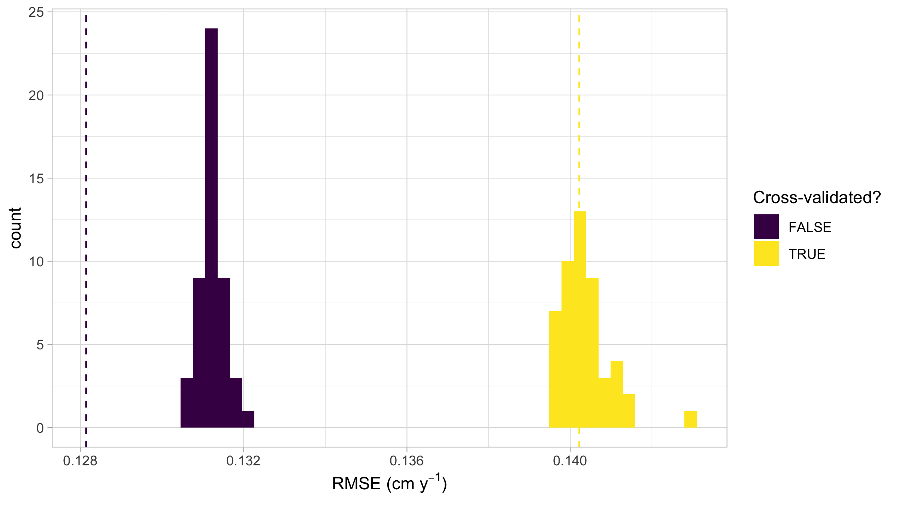

```{r setup, include = FALSE, cache = FALSE}
# Internally used packages
library(viridis)
library(knitr)
library(ggplot2)
library(here)
library(tibble)

# knitr settings
opts_chunk$set(
  # Code output:
  warning = FALSE,
  message = FALSE,
  echo = TRUE,
  cache = TRUE,
  # Figure:
  out.width = "100%",
  fig.path = "Figures/",
  fig.width = 16 / 2.5,
  fig.height = 9 / 2.5,
  fig.align = "center",
  fig.show = "hold",
  # Etc:
  collapse = TRUE,
  comment = "##",
  tidy.opts = list(width.cutoff=72),
  tidy = TRUE
)

# Random number generator seed value
set.seed(76)

# Set ggplot defaults output:
if (!is_html_output()) {
  # Grey theme:
  ggplot2::theme_set(theme_light())
  # Color scheme:
  # scale_colour_discrete <- scale_colour_viridis_d
}

# Set output width
options(
  width = 72, 
  # Decimal precision
  digits = 3, 
  # Number of rows for tibble printing
  tibble.print_max = 5, 
  tibble.print_min = 5
)
```

\doublespacing


# Introduction

Repeat-censused forest plots offer excellent opportunities to test neighborhood models of the effect of competition on the growth of trees (@canham_neighborhood_2004). Neighborhood models of competition have been used to: test whether the species identity of a competitor matters (@uriarte_spatially_2004); measure species-specific competition coefficients (@das_effect_2012 @tatsumi_estimating_2016); test competing models to see what structures competitive interactions, e.g. traits or phylogeny (@allen_permutation_2020; @uriarte_trait_2010); and inform selective logging practices (@canham_neighborhood_2006). Although these are well-described methods, no methods are currently available for their easy application. Here we address this in an R package. We largely follow the methods presented in @allen_permutation_2020. The package is written to model stem radial growth between two censuses based on neighborhood competition. 

@allen_permutation_2020 considers the following model: Let $i = 1, \ldots, n_j$ index all $n_j$ trees of "focal" species group $j$; let $j = 1, \ldots, J$ index all $J$ focal species groups; and let $k = 1, \ldots, K$ index all $K$ "competitor" species groups. We model the average annual growth in diameter $y_{ij}$ (in centimeters per year) of the $i^{th}$ tree of focal species group $j$ as a linear model $f$ of the covariates $\vec{x}_{ij}$

\begin{equation}
\label{eq:model}
y_{ij} = f(\vec{x}_{ij}) + \epsilon_{ij} = \beta_{0,j} + \beta_{\text{dbh},j} \cdot \text{dbh}_{ij} + \sum_{k=1}^{K} \lambda_{jk} \cdot \text{BA}_{ijk} + \epsilon_{ij}
\end{equation} 

where $\beta_{0,j}$ is the diameter-independent growth rate for group $j$; $\text{dbh}_{ij}$ is the diameter at breast height (in centimeters) of the focal tree at the earlier census; $\beta_{\text{dbh},j}$ is the amount of the growth rate changed depending on diameter for group $j$;  $\text{BA}_{ijk}$ is the sum of the basal area of all trees of competitor species group $k$; $\lambda_{jk}$ is the change in growth for individuals of group $j$ from nearby competitors of group $k$; and $\epsilon_{ij}$ is a random error term distributed $\text{Normal}(0, \sigma^2)$. They estimate all parameters via Bayesian linear regression while exploiting Normal/Inverse Gamma conjugacy to derive closed-form solutions to all posterior distributions via linear algebra^[See S1 Appendix of @allen_permutation_2020, available at https://doi.org/10.1371/journal.pone.0229930.s004]. These closed-form solutions for the posterior distributions are in contrast to approximations of all posteriors via computationally expensive Markov Chain Monte Carlo algorithms.

In order to evaluate whether competitor species identity matters, @allen_permutation_2020 run a permutation test where under the null hypothesis the species identity of all competitors of a focal tree can be permuted/shuffled:

\begin{eqnarray}
\label{eq:permutation-hypothesis-test}
&&H_0: \lambda_{jk} = \lambda_{j} \mbox{ for all } k = 1, \ldots, K\\
\text{vs.}&&H_A: \text{at least one } \lambda_{jk} \mbox{ is different}
\end{eqnarray}

where the null hypothesis $H_0$ reflects a hypothesis of no species grouping-specific effects of competition while the alternative hypothesis $H_A$ reflects a hypothesis of species grouping-specific effects of competition. Furthermore, in order to account for the spatial autocorrelation inherent to forest data in their estimates of out-of-sample model error, @allen_permutation_2020 use spatial cross-validation. Estimates of model error that do not account for this spatial dependency tend to underestiamte the true model error [@roberts_cross-validation_2017].

We introduce the `forestecology` R package providing methods and data for forest ecology model fitting and assessment, available on CRAN (https://cran.r-project.org/web/packages/forestecology/index.html) with the corresponding source code available on GitHub (https://github.com/rudeboybert/forestecology). The package implements all aspects of the model in Equation \ref{eq:model}: model fitting and generating fitted/predicted values, evaluating the effect of competitor species identity using permutation tests, and evaluating model performance using spatial cross-validation. 

The package designed with "tidy" design principles in mind [@wickham_welcome_2019]. Much like many of the `tidyverse` component packages, `forestecology` is designed with verb-named functions that can be modularly composed in sequence using the pipe `%>%` operator [@bache_pipe_2020]. As we articulate in Section \ref{casestudy}, these functions delineate the key steps in our analysis sequence. Furthermore, the inputs and outputs of nearly all of our functions use the same "simple features for R" data structures as implemented in the `sf` package for standardized support for spatial vector data [@pebesma_simple_2018]. The `sf` package is a `tidyverse`-friendly evolution of the `sp` package of classes and methods for spatial data in R [@pebesma_sp_2005]. As such, wrangling and visualization spatial data such as ours becomes much easier.

Currently the package only implements the Bayesian linear regression model of tree growth based on neighborhood competition detailed in Equation \ref{eq:model}. As we demonstrate in Section \ref{model-fit-predict} however, the fitting of this model is self-contained in a single function `comp_bayes_lm()`. This function returns an object of S3 class type `comp_bayes_lm` with generic methods implemented for `print()` to inspect the output, `predict()` to generate fitted/predicted values, and `ggplot2::autoplot()` to visualize all results. Therefore the package can be modularly extended to fit other models as long as they are coded into a function similar type as `comp_bayes_lm()` as has equivalent generic methods implemented.

We present a case-study of the `forestecology` package's use on data from the Smithsonian Conservation Biology Institute's (SCBI) large forest dynamics plot in Front Royal, Virginia, USA in Section \ref{casestudy}, which is part of the ForestGEO global network of research sites [@bourg_initial_2013, @andersonteixeira_ctfs-forestgeo_2015]. The package is designed with ForestGEO plot data in mind, but we envision that it could easily be modified to work with data from other forest plots, e.g. the US Forest Service Forest Inventory and Analysis plots or more generally to model interactions of any community of mapped sessile organisms [@smith_forest_2002].


# forestecology workflow: a case study {#casestudy}

We demonstrate the `forestecology` package's functionality on data from the Smithsonian Conservation Biology Institute (SCBI) large forest dynamics plot, located at the Smithsonian's National Zoo and Conservation Biology Institute in Front Royal, VA, USA [@bourg_initial_2013]. The 25.6 ha (640 x 400 m) plot is located at the intersection of three of the major physiographic provinces of the eastern US---the Blue Ridge, Ridge and Valley, and Piedmont provinces---and is adjacent to the northern end of Shenandoah National Park. The forest type is typical mature secondary eastern mixed deciduous forest, with a canopy dominated by tulip poplar (*Liriodendron tulipifera*), oaks (*Quercus* spp.), and hickories (*Carya* spp.), and an understory composed mainly of spicebush (*Lindera benzoin*), paw-paw (*Asimina triloba*), American hornbeam (*Carpinus caroliniana*), and witch hazel (*Hamamelis virginiana*) [@bourg_initial_2013]. 

The `forestecology` package has the following ecological goals: 1) to evaluate the effect of competitor species identity using permutation tests and 2) to evaluate model performance using spatial cross-validation. To achieve these goals, we outline a basic analysis sequence comprising of these four main steps:

1. Compute the growth of stems based on two censuses.
1. Add spatial information:
    1. Define a buffer region of trees.
    1. Add spatial cross-validation block information.
1. Identify all focal trees and their competitors.
1. Apply model, which includes:
    1. Fit model.
    1. Compute fitted/predicted values.
    1. Visualize posterior distributions.

We start by loading all necessary packages.

```{r load-packages}
library(tidyverse)
library(lubridate)
library(sf)
library(patchwork)
library(forestecology)
library(blockCV)
```


## Step 1: Compute the growth of trees based on census data {compute-growth}

The first step in the our analysis sequence is to compute the growth of trees using data from two censuses. The `compute_growth()` function computes average annual growth assuming census data that roughly follows ForestGEO standards. Despite such standards, minor variations will still exist between sites, thereby necessitating some data wrangling and checking. For example, the SCBI site records all diameters at breast height (DBH) in millimeters [@bourg_initial_2013], whereas the Michigan Big Woods site records them in centimeters [@allen_michigan_2020].

We load both 2008 and 2014 SCBI census data `.csv` files as they existed on GitHub on November 20, 2020 [@gonzalez-akre_scbi-forestgeoscbi-forestgeo-data_2020]. After selecting only the relevant variables, we perform a few additional data wrangling steps: convert the character variable with the date of measurement to be of explicit type `date`, convert DBH to be in centimeters^[A rule of thumb to determine the units of DBH is to check if the smallest non-zero and non-missing measurement is 1 or 10. If the former, then centimeters. If the later, then millimeters. This is because ForestGEO protocols state that only trees with DBH greater or equal to 1cm should be included in censuses.] Furthermore, in order to speed up computation for purposes of this example, we only consider a 9 ha subsection of the 25.6 ha of the SCBI site: `gx` from 0--300 instead of 0--400 and `gy` from 300--600 instead of 0--640.

```{r scbi-load-data}
census_2013_scbi <- read_csv("scbi.stem2.csv") %>%
  select(stemID, sp, date = ExactDate, gx, gy, dbh, codes, status) %>%
  mutate(
    date = mdy(date),
    dbh = as.numeric(dbh)/10
  ) %>%
  filter(gx < 300, between(gy, 300, 600))

census_2018_scbi <- read_csv("scbi.stem3.csv") %>%
  select(stemID, sp, date = ExactDate, gx, gy, dbh, codes, status) %>%
  mutate(
    date = mdy(date),
    dbh = as.numeric(dbh)/10
  ) %>%
  filter(gx < 300, between(gy, 300, 600))
```

These two data frames are then supplied as arguments to the `compute_growth()` function, along with the `id` argument that specifies the variable that uniquely identifies each tree-stem. Note furthermore that we discard all resprouts in the later census (those with `code == R`), since we are only interested in the diameter growth of surviving, and not resprouted, stems.

```{r scbi-compute-growth}
growth_scbi <-
  compute_growth(
    census_1 = census_2013_scbi,
    census_2 = census_2018_scbi %>% filter(!str_detect(codes, "R")),
    id = "stemID"
  )
growth_scbi
```

The output `growth_scbi` is a single data frame of class `sf` that includes variables `growth`, the average annual growth in DBH (cm y^-1^) for all stems that were alive at both time points, and `geometry`, the `sf` package's encoding of geolocations of type `<POINT>`. In addition the species variable `sp` is converted to a factor if it wasn't already by `compute_growth()`.^[In our spatial cross-validation algorithm in Section \ref{spatial-cross-validation} issues can occur when rare species do not occur in the training set, but then are encountered in the test set. This risk is mitigated by representing `sp` as a factor variable, which has a complete list of all levels of the categorical variable.] Furthermore, the variables that should remain unchanged between censuses appear only once, such as location variables `gx` and `gy`; as well as species-related variables. Variables that should change between censuses are suffixed with `1` and `2` indicating the earlier and later censuses, such as `dbh1/dbh2` and `codes1/codes2`. 

Site data that does not align with this convention will need to be transformed for use with the `compute_growth()` function. However, in the end, all that matters is that the growth of all stems is saved in a data frame of class `sf` and, at a minimum, contains the variable uniquely identifying each stem, `sp`, `dbh1`, `growth`, `geometry`.

Given that `growth_scbi` is of class `sf`, it can be easily plotted in `ggplot2` using the `geom_sf()` geometry as seen in Figure \ref{fig:scbi-trees} where we plot a random sample of 500 out of the `r nrow(growth_scbi)` trees.

```{r scbi-trees, out.width="66%", fig.cap="Compute growth of trees based on census data: Map with growth of a random sample of 500 trees from a 9 ha subsection of the Smithsonian Conservation Biology Institute (SCBI) forest plot."}
ggplot() +
  geom_sf(data = growth_scbi %>% sample_n(500), aes(size = growth)) + 
  scale_size_binned(limits = c(0.1, 1))
```


## Step 2: Add spatial information {#spatial-information}

The next step in our analysis sequence is to add additional spatial information to our main `growth_scbi` data frame. The first element of spatial information we add is a "buffer region" to the periphery of the study region. Since some of our model's explanatory variables are cumulative (such as competitor basal area), we must ensure that all trees being modeled are not biased to have different neighbor structures. This is of concern for trees at the boundary of study regions, for which all neighbors will not be included in the censused stems. In order to account for such edge effects, only trees that are not part of this buffer region, i.e. are part of the interior of the study region, will have their growth modeled [@waller_applied_2004].

Our model of interspecific competition relies on a spatial definition of who the competitor trees are for focal trees of interest: all trees within a distance `comp_dist` of a focal tree are considered its competitors (assuming the same units as the `gx` and `gy` location variables). In our case we set this value at 7.5m, a value informed by other studies [@canham_neighborhood_2004, @uriarte_spatially_2004, @canham_neighborhood_2006]. Using this value along with a manually constructed `sf` object representation of the study region's boundary via its vertices, we apply the `add_buffer_variable()` to our `growth_scbi` data frame to add a `buffer` boolean variable: all trees who have `buffer` set to `FALSE` will be our focal trees whose growth will be modeled, whereas those with `TRUE` will only be considered as competitor trees whose growth will not. 

```{r}
# Define buffer region using competitive distance range
comp_dist <- 7.5

study_region_scbi <- tibble(
  x = c(0, 300, 300, 0, 0),
  y = c(300, 300, 600, 600, 300)
) %>%
  sf_polygon()

growth_scbi <- growth_scbi %>%
  add_buffer_variable(size = comp_dist, region = study_region_scbi)
```

The second element of spatial information are blocks corresponding to folds of a spatial cross-validation algorithm used to estimate out-of-sample model error. Conventional cross-validation algorithms assign observations to folds by randomly resampling individual observations. However, many of these algorithms assume that the observations are independent of each other. In the case of forest census data, observations exhibit spatial autocorrelation. We therefore incorporate this spatial dependence into the cross-validation algorithm with our spatial blocks of trees [@roberts_cross-validation_2017 @pohjankukka_estimating_2017]
In the example below, we first manually define four folds that partition the study region as an `sf` object. We then use the output of the `spatialBlock()` function from the `blockCV` package to associate each tree in `growth_scbi` to the correct fold (saved in the `foldID` variable) [@valavi_blockcv_2019]. ^[In the Supporting Information we present an example where the folds themselves are also created using the `spatialBlock()` function given a specified `cv_block_size`.] 

```{r}
# Manually define spatial blocks to act as folds
n_fold <- 4
fold1 <- rbind(c(0, 300), c(150, 300), c(150, 450), c(0, 450))
fold2 <- rbind(c(150, 300), c(300, 300), c(300, 450), c(150, 450))
fold3 <- rbind(c(0, 450), c(150, 450), c(150, 600), c(0, 600))
fold4 <- rbind(c(150, 450), c(300, 450), c(300, 600), c(150, 600))

blocks_scbi <- bind_rows(
  sf_polygon(fold1), sf_polygon(fold2), sf_polygon(fold3), 
  sf_polygon(fold4)
) %>%
  mutate(folds = c(1:n_fold) %>% factor())

# Associate each observation to a fold
spatial_block_scbi <- spatialBlock(
  speciesData = growth_scbi, k = n_fold, selection = "systematic", 
  blocks = blocks_scbi, showBlocks = FALSE, verbose = FALSE
)

growth_scbi <- growth_scbi %>%
  mutate(foldID = spatial_block_scbi$foldID %>% factor())
```

Figure \ref{fig:scbi-spatial-information} illustrates the net effect of adding these two elements of information to the `growth_scbi` data frame. The location of each tree is marked with an integer indicating which fold it belongs to, where the folds are marked with solid lines. The color of each digit indicates whether the tree is part of the buffer region (and thus will only be considered as a competitor tree in our model) or is part of the interior of the study region (and thus is a focal tree whose growth is of modeled interest).

```{r scbi-spatial-information, out.width="66%", fig.cap="Add spatial information: Buffer region and spatial cross-validation blocks (1 through 4). All trees in the interior of the study region (i.e. not part of buffer) will be the focal trees whose growth will be modeled."}
ggplot() +
  geom_sf(data = blocks_scbi, fill = "transparent", linetype = "dashed") +
  geom_sf_text(data = growth_scbi %>% sample_n(1000), 
               aes(label = foldID, col = buffer))
```


## Step 3: Identify all focal and corresponding competitor trees {#focal-vs-comp}

The next step in our analysis sequence is to identify all focal trees and their corresponding competitor trees. More specifically, it identifies all trees that are not part of the buffer region, have a valid `growth` measurement, and have at least one neighbor within `r comp_dist` of it.  The `create_focal_vs_comp()` functions performs these tasks and returns a new data frame of type `sf`. On top of the previous arguments `comp_dist` defining the competition neighborhood and `id` indicating which variable uniquely identifies each tree-stem, this function also requires an `sf` object representation of the spatial cross-validation blocks/folds. In this example, the blocks were manually encoded in `blocks_scbi` by specifying it's vertices in Section \ref{spatial-information}^[We present an alternative method for defining spatial cross-validation blocks is using the `spatialBlock()` function from the `blockCV` package in the Supporting Information.]. We present the resulting data frame below with the `foldID` variable omitted for compactness of presentation.

```{r scbi-focal-vs-comp}
focal_vs_comp_scbi <- growth_scbi %>%
  create_focal_vs_comp(comp_dist, blocks = blocks_scbi, id = "stemID")
focal_vs_comp_scbi %>% 
  select(-foldID)
```

```{r, eval = FALSE, echo = FALSE}
# Internal: after removing trees in buffer and have NA for growth, there is one
# tree that is not included in focal_vs_comp_scbi b/c it has no neighbors within
# comp_dist = 7.5m of it
growth_scbi %>% 
  filter(!buffer & !is.na(growth)) %>% 
  filter(!stemID %in% focal_vs_comp_scbi$focal_ID)

growth_scbi %>% 
  mutate(flag = stemID == 18823) %>% 
  ggplot() +
  geom_sf(aes(col = flag))
```


The resulting data frame `focal_vs_comp_scbi` has `r nrow(focal_vs_comp_scbi)` rows, representing the subset of the `r nrow(growth_scbi)` trees in `growth_scbi` that will be considered as focal trees. Two new variables `focal_ID` and `focal_sp` relate to tree-stem identification and species information. Most notably however is a new variable `comp` which contains information on all competitor trees for a given focal tree, saved in `tidyr` package list-column format [@tidyr_package]. For example, we drill-down on the tree with `focal_ID` 4, which has 20 competitor trees each described by 4 variables as indicated by the fact that `comp` is a `tibble [20 × 4]`. 

```{r scbi-focal-vs-comp-2}
focal_vs_comp_scbi %>% 
  filter(focal_ID == 4) %>% 
  select(focal_ID, dbh, comp)
```

The spatial distribution of these trees is visualized in Figure \ref{fig:scbi-focal-vs-comp-map}: the dashed circle extends `r comp_dist` m away from the focal tree while all 20 competitor trees are within this circle. 

```{r scbi-focal-vs-comp-map, out.width="66%", echo = FALSE, fig.cap="Identify all focal and corresponding competitor trees: All 20 competitor trees of focal tree 4."}
comp_radius <- growth_scbi %>% 
  filter(stemID == 4) %>% 
  st_buffer(dist = comp_dist)

comp_radius_box <- growth_scbi %>% 
  filter(stemID == 4) %>% 
  st_buffer(dist = comp_dist + 10) %>% 
  st_bbox() %>% 
  st_as_sfc() %>% 
  st_intersects(growth_scbi, ., sparse = FALSE)

growth_scbi_subset <- growth_scbi %>% 
  mutate(inside = comp_radius_box) %>% 
  filter(inside)

ggplot() +
  geom_sf(data = growth_scbi_subset, aes(col = sp, size = dbh1)) +
  geom_sf(data = comp_radius, linetype = "dashed", alpha = 0, inherit.aes = FALSE) +
  coord_sf(xlim = st_bbox(comp_radius)[c("xmin", "xmax")], ylim = st_bbox(comp_radius)[c("ymin", "ymax")]) +
  geom_sf_text(data = growth_scbi %>% filter(stemID == 4), aes(label = stemID), size = 12) +
  labs(size = "DBH at first census", col = "species") 
```

Using the `unnest()` function from the `tidyr` package, we can flatten list-column into regular columns. We observe that for the same focal tree, we have information on all 20 competitor trees whose `dist` distance to the focal tree is $\leq$ `r comp_dist`: their unique tree-stem ID number, their species, and their basal area (in m$^2$) calculated as $\frac{\pi \times (\text{DBH/2})^2}{10000}$ where $DBH$ is the value from the earlier of the two censuses in cm. Saving our focal versus competitor information in list-column minimizes redundancy since we do not repeat information on the focal tree 20 times. 

```{r, scbi-focal-vs-comp-3}
focal_vs_comp_scbi %>% 
  filter(focal_ID == 4) %>% 
  select(focal_ID, dbh, comp) %>% 
  unnest(cols = "comp")
```


## Step 4: Fit model {#model-fit-predict}

Now that we've identified all focal and corresponding competitor trees and saved this information in a data frame of type `focal_vs_comp`, the final step in our analysis sequence is to fit a model for the growth of all focal trees. Currently the `forestecology` package can only fit the competition Bayesian linear regression model outlined in Section \ref{competition-model} using the `comp_bayes_lm()` function. However, any model implemented in a function that similarly takes an input data frame of type `focal_vs_comp` as an argument can also be used. For our specific competition Bayesian linear regression model, we also specify prior distributions on all parameters of interest (here chosen to be the defaults as specified in `?comp_bayes_lm`). 

```{r scbi-model-fit}
comp_bayes_lm_scbi <- focal_vs_comp_scbi %>%
  comp_bayes_lm(prior_param = NULL)
```

The returned `comp_bayes_lm_scbi` output is an object of S3 class type `comp_bayes_lm` which contains the posterior values of all parameters in our competition Bayesian linear regression. This class of object includes generic methods implemented for `print()`, `predict()`, and `ggplot2::autoplot()`. First the generic for `print()` displays the names of all prior & posterior parameters along with the model formula:

```{r}
comp_bayes_lm_scbi
```

Next, the generic for `predict()` takes as inputs the posterior parameter values in `comp_bayes_lm_scbi` and the predictor variables in `newdata` and outputs a vector of fitted/predicted values $\widehat{y}$ of the DBH for each focal tree computed from the posterior predictive distribution.

```{r scbi-model-predict}
focal_vs_comp_scbi <- focal_vs_comp_scbi %>%
  mutate(growth_hat = predict(comp_bayes_lm_scbi, newdata = focal_vs_comp_scbi))
```
```{r}
focal_vs_comp_scbi
```

We then compare the observed and fitted/predicted growths to compute the root mean squared error (RMSE) of our model fit.

```{r scbi-model-rmse}
model_rmse <- focal_vs_comp_scbi %>%
  rmse(truth = growth, estimate = growth_hat) %>%
  pull(.estimate)
model_rmse
```

Lastly, the generic for `ggplot2::autoplot()` allows us to plot the posterior distribution of all parameters in Figure \ref{fig:scbi-posterior-viz} (for compactness we only show posteriors for 3 species). 

```{r scbi-posterior-viz, out.width="100%", fig.cap= "Fit model: Posterior distributions of all parameters for three species."}
# Plot posteriors for only a subset of species
sp_to_plot <- c("litu", "quru", "cagl")

plot1 <- autoplot(comp_bayes_lm_scbi, type = "intercepts", 
                  sp_to_plot = sp_to_plot)
plot2 <- autoplot(comp_bayes_lm_scbi, type = "dbh_slopes", 
                  sp_to_plot = sp_to_plot)
plot3 <- autoplot(comp_bayes_lm_scbi, type = "competition", 
                  sp_to_plot = sp_to_plot)

# Combine plots using patchwork
(plot1 | plot2) / plot3
```

These plots give the posterior distributions of parameters from Equation \ref{eq:model}. For many package users they will be of interest because they give insight into the species-specific competitive interactions. Setting `type = "intercepts"` gives posterior distributions for $\beta_{0,j}$ and `type = "dbh_slopes"` for $\beta_{dbh,j}$. These give species specific growth independent of competition. The values of more interest are plotted with `type = 'competition'` which gives the posterior distribution for $\lambda_{j,k}$ species-specific competition coefficients (i.e., the $\lambda$-matrix). Negative values indicate a competitor species which slows the growth of a focal species. Here, for example, we see that tulip trees (`litu`) have a strong negative effect on the growth of conspecifics but relatively little effect on neighbors of the other two species.

## Evaluate the effect of competitor species identity using permutation tests

In order to evaluate the effect of competitor species identity, we use the four steps of our analysis sequence answer along with a permutation test: Under a null hypothesis where competitor species identity does not matter, we can permute/shuffle this variable within each focal tree, compute the RMSE (the test statistic of interest), repeat this process several times to construct a null distribution of the RMSE, and compare it to the observed RMSE to assess significance. Going back to our example in Section \ref{focal-vs-comp} of focal tree with `focal_ID` 4 and its 20 competitors, the permutation test randomly resamples the `comp_sp` variable with replacement, leaving all other variables intact. The resampling with replacement is nested within each focal tree in order to preserve the neighborhood structure of our competition model. To run the permutation test, we use the same `comp_bayes_lm()` function as in Section \ref{model-fit-predict}, but with a `run_shuffle = TRUE` argument.

```{r scbi-permutation-model-fit}
comp_bayes_lm_scbi_shuffle <- focal_vs_comp_scbi %>%
  comp_bayes_lm(prior_param = NULL, run_shuffle = TRUE)

focal_vs_comp_scbi <- focal_vs_comp_scbi %>%
  mutate(
    growth_hat_shuffle = predict(comp_bayes_lm_scbi_shuffle, 
                                 newdata = focal_vs_comp_scbi)
  )
```
```{r}
model_rmse_shuffle <- focal_vs_comp_scbi %>%
  rmse(truth = growth, estimate = growth_hat_shuffle) %>%
  pull(.estimate)
model_rmse_shuffle
```

The resulting RMSE of `r model_rmse_shuffle` based on the permutation test is `r ifelse(model_rmse_shuffle < model_rmse, "smaller", "larger")` than the earlier RMSE of `r model_rmse`, suggesting that models that do incorporate competitor species identity better fit the data.  


## Evaluate model performance using spatial cross-validation {#spatial-cross-validation}

We answer the second of our two questions: how can we obtain an accurate estimate of model performance/error?  The model fits and predictions in Section \ref{model-fit-predict} all suffer from a common failing: they use the same data to both fit the model and to assess the model's performance using the RMSE. As argued by @roberts_cross-validation_2017, this can lead to overly optimistic assessments of model quality as the models can be overfit, in particular in situations where spatial-autocorrelation is present. To mitigate the effects of such overfitting, we use a spatially block cross-validation algorithm.

To this end, we use the `foldID` variable defined in Section \ref{spatial-information} whereby all focal trees are assigned to one of `r n_fold` spatially contiguous blocks that act as folds in our cross-validation routine. Figure \ref{fig:scbi-spatial-cross-validation-schematic} presents a schematic illustrating this scheme for fold 1 (bottom-left) as the test set and folds 2, 3, and 4 as the training sets. We fit the model to all focal trees in the training set, apply the model to all focal trees in the test set to compute fitted/predicted values, and compute the RMSE of the observed versus predicted growths. We repeat this procedure 3 more times with each of the three remaining folds acting as the test set and then average all four resulting RMSE's. Furthermore, in order to maintain spatial independence between the test and training set, a fold buffer that extend outwards from the boundary of the test set is computed; all trees falling within this fold buffer are excluded from the training set. 

```{r scbi-spatial-cross-validation-schematic, out.width="66%", fig.cap= "Schematic of spatial cross-validation: Using the k = 1 fold as the test set, assigning each focal tree to training set, test set, and fold buffer.", echo = FALSE}
fold_number <- 1

test_fold_buffer <- blocks_scbi %>% 
  filter(folds == fold_number)
                                              
test_vs_train <- focal_vs_comp_scbi %>% 
  st_as_sf() %>% 
  add_buffer_variable(
    direction = "out", size = comp_dist, region = test_fold_buffer
  ) %>% 
  mutate(
    fold = case_when(
      foldID == fold_number ~ "test",
      foldID != fold_number & buffer ~ "training",
      foldID != fold_number & !buffer ~ "fold buffer"
    ),
    fold = factor(fold, levels = c("test", "fold buffer", "training"))
  )

ggplot() +
  geom_sf(data = compute_buffer_region(test_fold_buffer, direction = "out", size = comp_dist), col = "red", fill = "transparent") +
  geom_sf(data = blocks_scbi, fill = "transparent", linetype = "dashed") +
  geom_sf(data = test_vs_train %>% st_as_sf() %>% sample_n(1000), aes(col = fold, shape = fold))
```

This algorithm is implemented in the `run_cv()` function, which is a wrapper function to the `comp_bayes_lm()` function that fits the model and the `predict()` generic that returns fitted/predicted values. We compare these values to the observed growth values to again compute our RMSE.

```{r scbi-spatial-cv}
focal_vs_comp_scbi <- focal_vs_comp_scbi %>%
  run_cv(comp_dist = comp_dist, blocks = blocks_scbi)
```
```{r}
model_rmse_cv <- focal_vs_comp_scbi %>%
  rmse(truth = growth, estimate = growth_hat) %>%
  pull(.estimate)
model_rmse_cv
```

The resulting RMSE of `r model_rmse_cv` computed using cross-validation is `r ifelse(model_rmse_cv > model_rmse, "larger", "smaller")` than the earlier RMSE of `r model_rmse`, suggesting that models that do not take the inherent spatial autocorrelation of the data into account generate error estimates that are overly optimistic; in our case RMSE's that are too low.  


# Importance of spatial cross validation

The `run_cv` function also accepts the `run_shuffle` argument. This permutes the competitor species, as described above, but does so when calculating predicted growth with the cross validated scheme. Figure \ref{fig:scbi-simulation} compares model performance when permuting competitor species and calculating RMSE with and without cross validation. Without cross-validation the competitor identity did matter, the non-permuted competitor species had a much lower RMSE than the permuted one. But once we include the spatial cross validation this improvement disappears. So in this 9 ha subplot of the SCBI plot competitive interactions do not depend on the identity of the competitor, which is the opposite of what has been observed in other places (@allen_permutation_2020 @uriarte_spatially_2004). This highlights the importance of cross validation, without it the model was overfit. 

```{r scbi-simulation, out.width="100%", fig.cap="Root mean squared error of models for standard, permuted, and spatial cross-validated error estimates. The dotted lines show non-permuted competitor identity, while the histogras so the RMSE for 49 permutations. The colors indicate whether cross validaton was used.", echo = FALSE}

```


# Conclusion

The `forestecology` package provides an accessible way to fit and test models of neighborhood competition. Currently it is written to work with data from ForestGEO plots. But it could easily be modified to work on any single large, mapped forest plot in which at least two measurements of each individual have been taken. With a little bit of work the package could also be applied to forest inventory data in which several small plots are spatially separated, e.g., USFS Forest Inventory. In a future version of the package we also hope to make it possible to model plant mortality in addition to plant growth. The package follows the guidelines for `tidy` data, `sf` spatial structure, and S3 open-oriented model structure. We hope that the package will increase the use of neighborhood competition models to better understand what structures plant competition.

# Acknowledgments

The authors thank Ryan Giordano and Jonathan Che for their help with the statistical methodology and Sophie Li for their feedback on package interface. The authors declare no conflicts of interest.


# Author's contributions

AYK and DNA conceived the ideas and coded a draft of the package. AYK wrote an initial manuscript draft. SPC rewrote much of the package's code to align with R and "tidy" best practices [@wickham_welcome_2019]. All authors contributed to subsequent drafts and gave final approval for manuscript.


# Data accessibility

We intend to archive all data and source code for the `forestecology` package as well as this manuscript on GitHub at https://github.com/rudeboybert/forestecology. This repository will be versioned and archived on Zenodo upon acceptance. The 2008 and 2014 Smithsonian Conservation Biology Institute census data loaded in Section \ref{compute-growth} and saved in `scbi.stem2.csv` and `scbi.stem3.csv` are available on GitHub at https://github.com/SCBI-ForestGEO/SCBI-ForestGEO-Data/tree/master/tree_main_census/data/census-csv-files and have been versioned and archived on Zenodo at https://doi.org/10.5281/zenodo.2649301 [@gonzalez-akre_scbi-forestgeoscbi-forestgeo-data_2020].


# References


